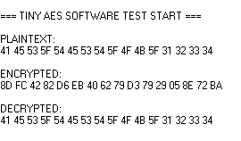
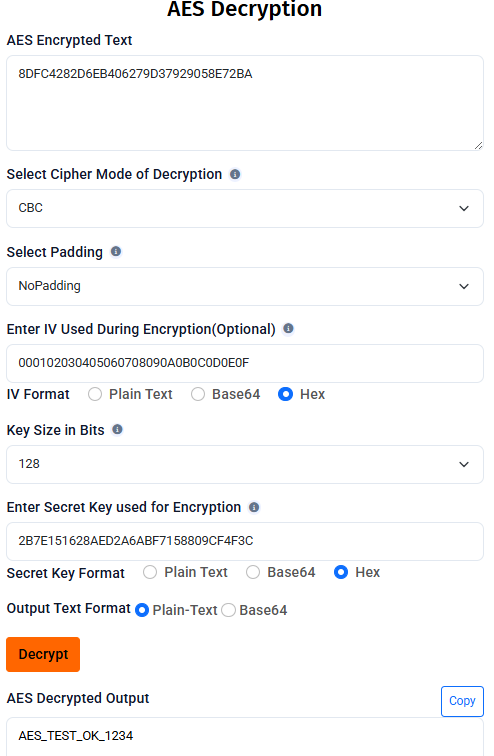

<h1 align="center">🔐 STM32 AES-128 CBC (Software Implementation)</h1>

<p align="center">
AES-128 encryption and decryption in <b>CBC mode</b> implemented in software on an <b>STM32L4 microcontroller</b>.
</p>

<p align="center">
Built using <b>STM32CubeIDE</b> and <b>STM32 HAL</b>.
</p>

---

# 📌 Overview

This project demonstrates **AES-128 encryption and decryption in CBC mode** running on an **STM32 microcontroller using a pure software implementation**.

The AES algorithm is based on the lightweight open-source library:

https://github.com/kokke/tiny-AES-C

The following files from the library are integrated into the firmware:

* `aes.c`
* `aes.h`

All cryptographic operations are executed **in software**.
The **STM32 hardware AES/CRYP peripheral is not used**.

---

# ⚙️ Platform

| Item         | Description    |
| ------------ | -------------- |
| MCU          | STM32L4 Series |
| IDE          | STM32CubeIDE   |
| Framework    | STM32 HAL      |
| Debug Output | UART           |

---

# 📂 Project Structure

```
STM32-AES-128-CBC
│
├── Core
│   ├── Inc
│   └── Src
│       ├── main.c
│       ├── app.c
│       └── aes.c
│
├── Drivers
│
├── docs
│   ├── AES-Decryption.png
│   └── Output.png
│
└── README.md
```

---

# 🚀 Functionality

The firmware performs a **basic AES validation test**:

1. A **16-byte plaintext block** is defined
2. Data is encrypted using **AES-128 CBC mode**
3. Encrypted output is printed over **UART**
4. Data is decrypted
5. Decrypted output is printed to verify correctness

---

# 🖥 Example UART Output

The decrypted output matches the original plaintext, confirming correct AES operation.

---

# 📷 STM32 Output Screenshot

<p align="center">
<br>
<b>Figure 1:</b> UART output from STM32 AES software test
</p>

---

# 🔑 Test Parameters

| Parameter | Value                            |
| --------- | -------------------------------- |
| AES Mode  | CBC                              |
| Key Size  | 128-bit                          |
| Padding   | NoPadding                        |
| Key       | 2B7E151628AED2A6ABF7158809CF4F3C |
| IV        | 000102030405060708090A0B0C0D0E0F |
| Plaintext | AES_TEST_OK_1234                 |

---

# ✅ Encryption Verification

The generated ciphertext was verified using the following AES tool:

<p align="center">
<br>
<b>Figure 2:</b> AES verification using Devglan AES tool
</p>

---

# 📝 Notes

* AES block size = **16 bytes**
* Input data must be a **multiple of 16 bytes**
* **Padding is not implemented** in this example
* IV must be **reinitialized before decryption** in CBC mode

---

# 🙏 Credits

AES implementation used in this project:

**tiny-AES-c**

https://github.com/kokke/tiny-AES-C

---

# 📜 License

This project uses the AES implementation provided by **tiny-AES-c**, which is distributed under the **Unlicense / public domain** license.

Refer to the original repository for full license details.

---

<p align="center">
⭐ If you found this project useful, consider starring the repository.
</p>
